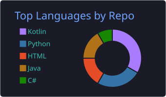
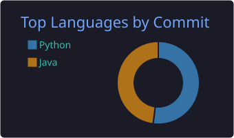

  <h1 align="center">¡Hola! Soy Diego Pérez</h1>
  <h3 align="center">Estudiante de Desarrollo de Aplicaciones Multiplataforma (DAM)</h3>
  
  
  
  

---

## Sobre mí

Actualmente estoy cursando el Ciclo Superior de **Desarrollo de Aplicaciones Multiplataforma**. Me gusta la programación y la creación de interfaces de usuario funcionales.

-  **Trabajando en:** Una aplicación móvil nativa con **Kotlin**.
-  **He aprendido:** Bases sólidas en **Java** y **Python**.
-  **Intereses:** Desarrollo de escritorio y ecosistema móvil.
-  **Objetivo:** Seguir mejorando mis habilidades en desarrollo móvil y backend.

---

##  Mis Tecnologías Utilizadas

Aquí están las herramientas con las que construyo mis proyectos:

    
  
  

---

## 📂 Proyectos Destacados
### Panel de Administración de Fincas (Desktop App)
>Aplicación de escritorio desarrollada con **Python** y **QtDesigner**. Es un sistema de gestión integral para comunidades de vecinos que permite administrar propietarios, controlar incidencias y generar documentación oficial, con una interfaz moderna y eficiente.

**Ver código:** [Link al repositorio de este proyecto](https://github.com/Dieguuo/PanelVeciGest)

### GargStream (Web App)
>Plataforma de streaming diseñada para gestionar y visualizar contenido multimedia. Permite la administración completa de películas, series y capítulos, gestión de usuarios con roles, sistema de favoritos, valoraciones y reproducción de vídeo adaptativa.
>* **Panel de Administración:** Gestión CRUD completa. Permite la subida de vídeos, gestión de carátulas y edición de metadatos.
>* **Seguridad:** Implementación de **Spring Security** con autenticación segura, protección CSRF y manejo de sesiones de usuario.
>* **UX/UI Moderna:** Interfaz responsiva construida con **Thymeleaf**. Incluye buscador en tiempo real, votación por estrellas y funcionalidad "Añadir a Mi Lista".

**Ver código:** [Link al repositorio de este proyecto](https://github.com/Dieguuo/GargStream)

###  VeciGest (Mobile App)
>Aplicación Android nativa diseñada para la **gestión de comunidades de vecinos**. El objetivo es facilitar la comunicación entre propietarios y administradores.

>**Estado:**  Desarrollo inicial.

---

### 📊 Mis Estadísticas

  
  
   

